# 3D Seismic Attribute Reservoir Analytics

Exploratory 3D seismic attribute notebooks for reservoir property prediction and interpretation.

## Screenshots

<!-- screenshots:start -->
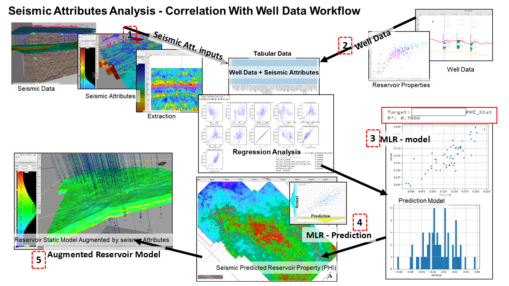

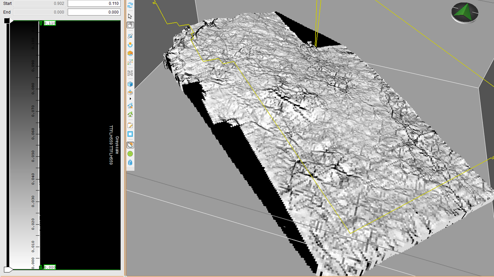

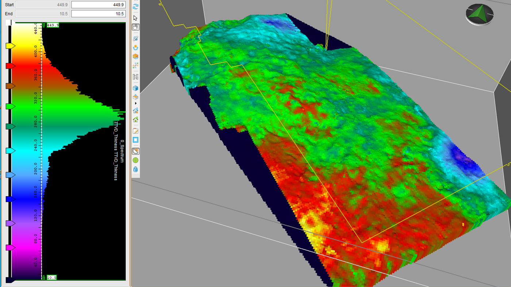

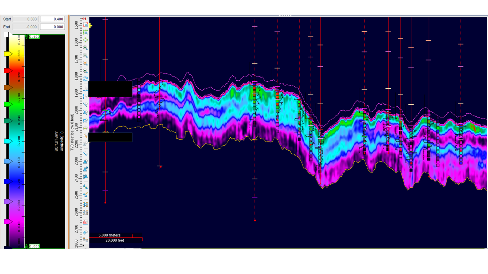

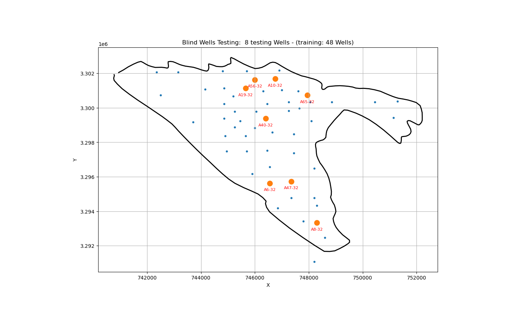

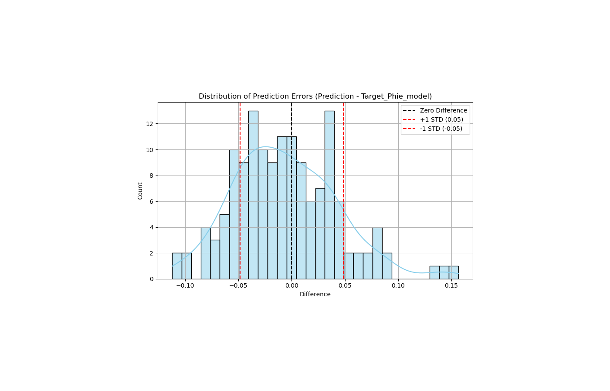

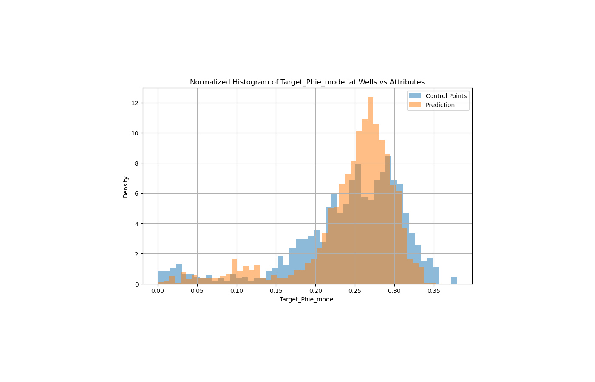

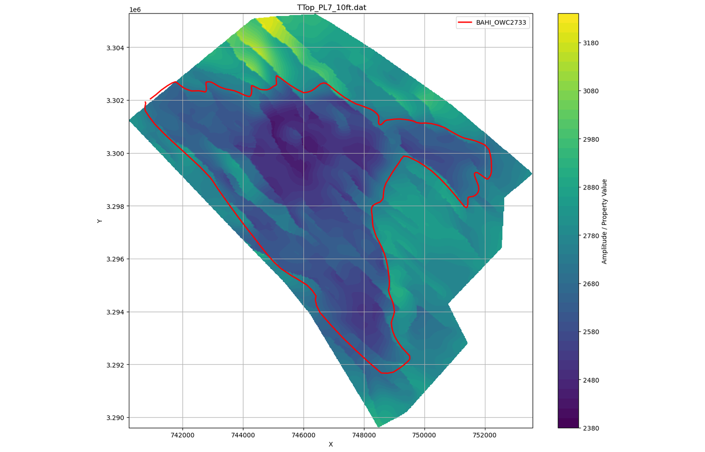

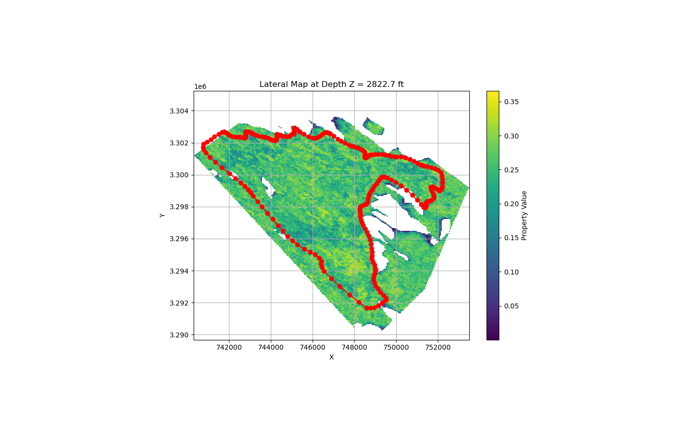

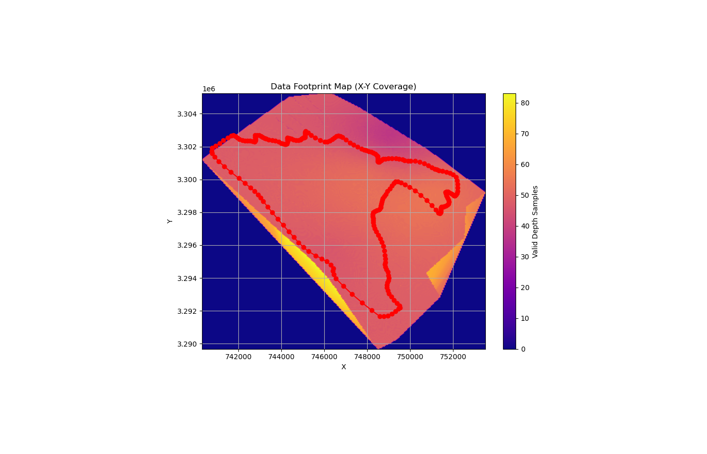


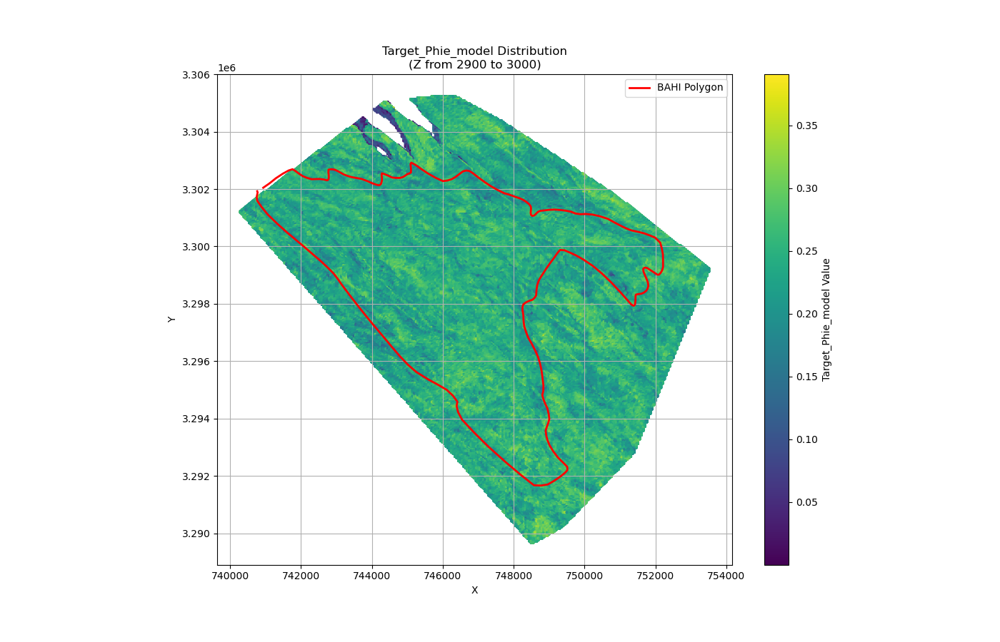

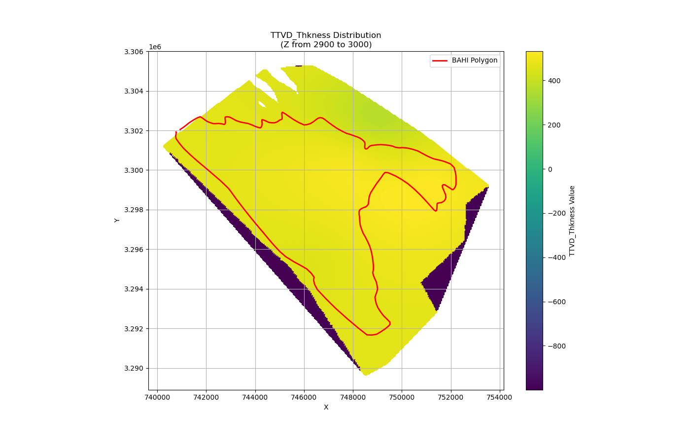

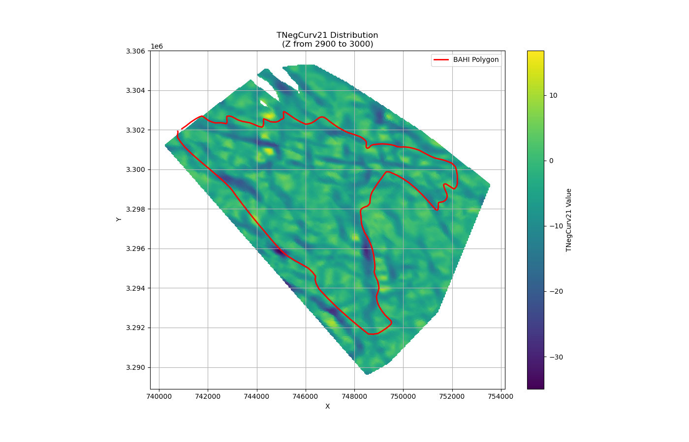

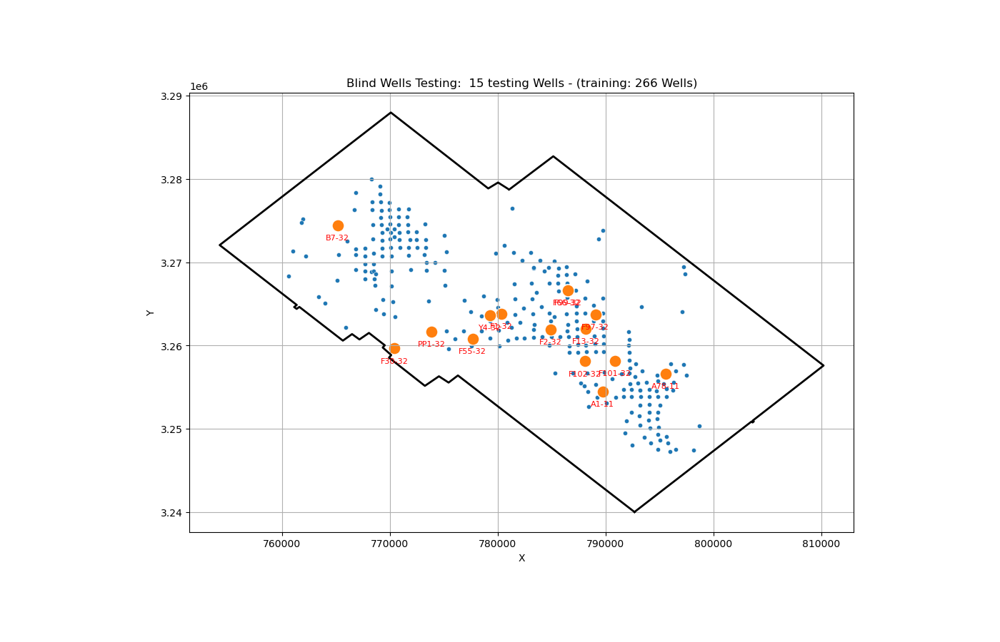

<!-- screenshots:end -->

## Repository Status

Public-facing 3D seismic attribute analytics workflow using curated explanatory screenshots and sanitized portfolio assets.

## What This Demonstrates

- Domain-focused analytical thinking
- Python/Jupyter workflow development
- Data cleaning and transformation
- Visualization and interpretation
- Reproducible project packaging

## Run Locally

```bash
python -m venv .venv
pip install -r requirements.txt
jupyter lab
```

For Streamlit apps:

```bash
streamlit run app.py
```

## Data And Inputs

This repository is prepared for public portfolio use. Inputs committed here should be synthetic, public, or otherwise approved for sharing.
